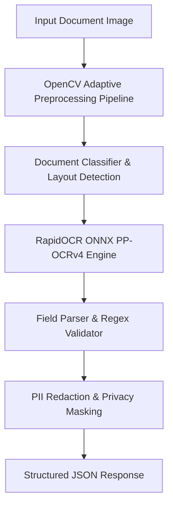

# Configurable OCR Extraction System for Pakistani CNIC and Passport Documents

[](https://www.python.org/)
[](https://fastapi.tiangolo.com/)
[](https://github.com/PaddlePaddle/PaddleOCR)
[](https://opencv.org/)
[](https://www.docker.com/)

A production-oriented Python OCR and document-extraction engine built on top of **PaddleOCR / RapidOCR ONNX** and an **Adaptive Document Image Preprocessing Pipeline**, designed specifically for **Pakistani CNIC (Front & Back, Bilingual Urdu/English)** and **International Passports**.

## Overview

Extracting text from Pakistani identity documents presents unique computer vision challenges due to mixed language scripts (Urdu and English), complex guilloche background patterns, varied camera captures, lighting distortions, and privacy constraints.

This repository provides an end-to-end Python engine that:
1. Performs adaptive image preprocessing (perspective correction, noise removal, binarization).
2. Classifies document types (CNIC Front, CNIC Back, Passport).
3. Executes text detection and recognition using RapidOCR ONNX (PP-OCRv4).
4. Extracts structured data fields with high confidence and regex validation.
5. Applies automated security masking to confidential fields (e.g., CNIC numbers, signatures).

## Key Features

* **Bilingual Text Recognition**: Optimized for mixed English and Urdu typography.
* **Adaptive Preprocessing Pipeline**: Automatic deskewing, noise filtering, and edge detection using OpenCV.
* **Document Classification**: Automatic detection of CNIC Front, CNIC Back, and Passport layouts.
* **Field Validation & Scoring**: Regex-backed extraction for CNIC numbers (e.g. `XXXXX-XXXXXXX-X`), names, dates of birth, issue/expiry dates, and gender with confidence metrics.
* **Privacy & Redaction Module**: Automated masking of identity fields for privacy compliance before database persistence.
* **Dual Execution Modes**: Available via **FastAPI REST API**, **Click CLI**, and standalone **Python Module**.
* **Integrated Benchmarking Suite**: Evaluates OCR accuracy, precision/recall, and latency across test document sets.

## Architecture



## Tech Stack

* **Core Language**: Python 3.10+ / 3.14
* **Computer Vision**: OpenCV (`opencv-python`), Pillow, NumPy
* **OCR Engines**: RapidOCR (`rapidocr-onnxruntime`), PaddleOCR PP-OCRv4
* **REST API Framework**: FastAPI, Uvicorn, Pydantic v2
* **CLI Engine**: Click
* **Testing & Quality**: pytest, HTTPX
* **Deployment**: Docker, Dockerfile

## Project Structure

```text
OCR/
├── app/
│   ├── api/             # FastAPI Endpoints, Schemas & Models
│   ├── classification/  # Document Layout Classifier
│   ├── core/            # Error Handling, Privacy Masking, Security & Versioning
│   ├── documents/       # CNIC & Passport Specific Parsers, Pipelines & Validators
│   ├── benchmark/       # Accuracy & Latency Benchmarking Runner
│   ├── cli.py           # Command Line Interface (Click)
│   └── main.py          # FastAPI Application Entrypoint
├── tests/               # Pytest Automated Test Suite
├── Dockerfile           # Production Docker Container Specification
├── requirements.txt     # Python Dependencies
└── README.md
```

## Installation & Usage

### 1. Installation
```bash
git clone https://github.com/SAfiyanRafi/OCR.git
cd OCR

python -m venv venv
# On Windows PowerShell:
.\venv\Scripts\Activate.ps1
# On Linux/macOS:
source venv/bin/activate

pip install -r requirements.txt
```

### 2. Run CLI Extraction
```bash
python -m app.cli extract path/to/cnic_front.jpg --doc-type cnic_front
```

### 3. Start REST API Server
```bash
uvicorn app.main:app --reload --port 8000
```
Interactive Swagger API documentation is available at `http://localhost:8000/docs`.

### 4. API Usage Example
```bash
curl -X POST "http://localhost:8000/api/v1/extract"   -H "accept: application/json"   -H "Content-Type: multipart/form-data"   -F "file=@sample_cnic.jpg"   -F "document_type=cnic_front"
```

### 5. Run Benchmark Suite
```bash
python -m app.benchmark.run
```

## Security & Privacy

* **Local Inference**: All OCR processing runs locally or on self-hosted containers without sending images to third-party cloud APIs.
* **Automatic Redaction**: Integrated PII redaction engine strips sensitive identity numbers upon request.

## License

This project is licensed under the [MIT License](LICENSE).
